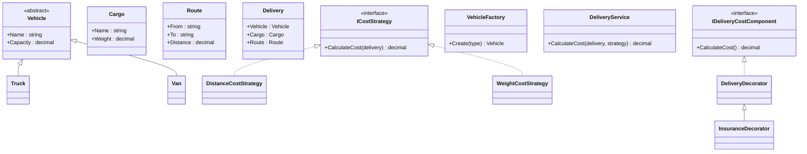

# Logistics and Fleet Management (Practice Project)

## Overview
This repository contains a C# console application for OOP practice on the domain of logistics and fleet management.

The solution targets **.NET 8** and is split into four projects:
- `Logistics.Domain` - domain entities and lifecycle-focused objects
- `Logistics.Application` - business logic and design pattern implementations
- `Logistics.ConsoleApp` - CLI entry point and usage examples
- `Logistics.Tests` - xUnit tests

## Architecture
The code follows a layered structure:
1. `Domain` stores pure models (`Vehicle`, `Truck`, `Van`, `Cargo`, `Route`, `Delivery`).
2. `Application` contains use-case logic (`DeliveryService`) and patterns.
3. `ConsoleApp` orchestrates scenarios and prints reports.
4. `Tests` validates business behavior and object lifecycle behavior.

## UML Class Diagram (Simplified)


## Patterns Used
- **Strategy**: `ICostStrategy`, `DistanceCostStrategy`, `WeightCostStrategy`
- **Factory Method**: `VehicleFactory`
- **Decorator**: `DeliveryDecorator`, `InsuranceDecorator`

## Object Lifecycle Coverage
The project demonstrates:
- Main constructor
- Parameterized constructor
- Copy constructor

These are implemented in domain entities (`Cargo`, `Route`, `Truck`, `Van`, `Delivery`) and in `CargoManifestBuffer`.

For resource lifecycle, `CargoManifestBuffer` implements:
- `IDisposable`
- Finalizer
- Full dispose pattern with native memory cleanup

## Getting Started
```bash
dotnet restore LogisticsSystem.sln
dotnet build LogisticsSystem.sln
dotnet run --project Logistics.ConsoleApp/Logistics.ConsoleApp.csproj
dotnet test LogisticsSystem.sln
```

## Example Console Output
The app prints:
- delivery info (vehicle, cargo, route)
- calculated delivery cost
- validation error when cargo weight exceeds vehicle capacity
- summary by successful deliveries

## Git Setup
Repository is initialized with `.gitignore` for .NET and IDE artifacts.
